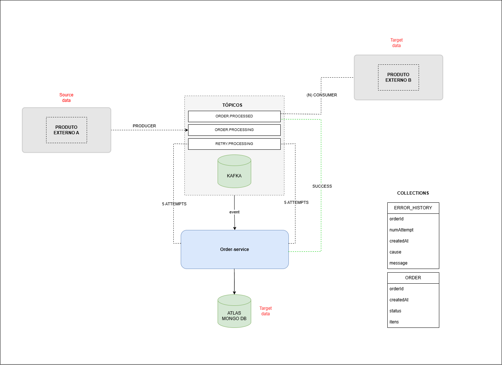
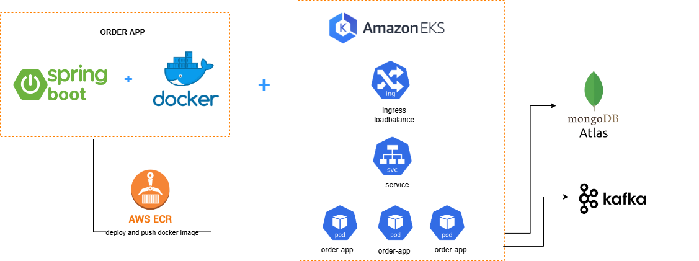

# ORDER SERVICE

**Descrição**: Microsserviço responsável por gerenciar e calcular produtos do pedido.

---
## Arquitetura microsserviço

A arquitetura do projeto está representada na imagem abaixo:




## Sugestão de infraestrutura para deploy
Esta é uma infraestrutura de deploy que garante alta disponibilidade e escalabilidade para o microsserviço. O uso do Amazon EKS (Elastic Kubernetes Service) permite o gerenciamento automático de pods e balanceamento de carga para distribuir o tráfego, garantindo resiliência. O Docker facilita a portabilidade e consistência entre ambientes, enquanto o AWS ECR armazena as imagens, facilitando o deploy contínuo. O MongoDB Atlas proporciona armazenamento de dados escalável, e o Kafka possibilita processamento assíncrono para lidar com grandes volumes de dados, melhorando o desempenho e a flexibilidade no processamento de pedidos.


---
## Tecnologias Utilizadas

Este projeto foi desenvolvido utilizando as seguintes tecnologias e ferramentas:

- **Java 21**: Linguagem principal do backend.
- **Gradle**: Ferramenta de automação para build.
- **Spring Boot**: Framework para desenvolvimento de microsserviços.
- **Kafka**: Sistema de mensageria para comunicação assíncrona.
- **MongoDB**: Banco de dados NoSQL.
- **Spring Data MongoDB**: Abstração de persistência para MongoDB.
- **MapStruct**: Framework para mapeamento de objetos.
- **Lombok**: Redução de código boilerplate em classes Java.
- **JUnit**: Framework para testes unitários.
- **Mockito**: Ferramenta para criação de mocks nos testes.
- **Docker**: Containerização para ambiente padronizado.

---

## Requisitos para Build e Execução

### Pré-requisitos

Certifique-se de ter as ferramentas abaixo instaladas:

- **Java 21**
- **Docker** (opcional para execução com containers)
- **Gradle** (para build)

### Configurações de Ambiente

1. Configure as variáveis de ambiente necessárias:
    - **MongoDB**:
        - `MONGO_URI`: String de conexão com o banco.
    - **Kafka**:
        - `KAFKA_BROKER`: Endereço do broker Kafka

---

## Instruções de Build e Execução

### Docker compose
1. Rodar kafka local:
   ```bash
   docker-compose up -d

### MongoDB Atlas
   Criar uma instância cluster do mongo no Atlas: https://cloud.mongodb.com/   

### Backend (Spring Boot)

1. Clone o repositório:
   ```bash
   git clone https://github.com/fabiojuniorr/order.git

2. Compile e construa o projeto:

   ```bash
   ./gradlew clean build

3. Execute a aplicação localmente:

   ```bash
   java -jar build/libs/order-0.0.1-SNAPSHOT.jar


